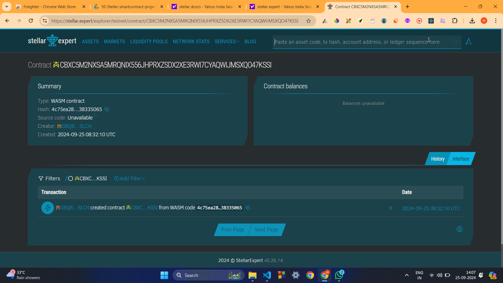

##### Deployed smartcontract address: CBXC5M2NXSA5MRQNIX556JHPRXZSDX2XE3RWI7CYAQWIJMSXQO47KSSI

# Crypto-based Real Estate Marketplace

## Project Title
Crypto-based Real Estate Marketplace

## Project Description
The Crypto-based Real Estate Marketplace is a decentralized platform that allows users to buy, sell, and rent properties using Stellar tokens. Smart contracts ensure transparency and security by handling property ownership transfers, rental agreements, and payments, providing a seamless experience for both buyers and sellers.

## Project Vision
To revolutionize the real estate market by leveraging blockchain technology for secure, transparent, and efficient property transactions. The platform aims to provide a decentralized and trustless environment for global real estate trading using Stellar tokens.

## Key Features
- **Property Listing:** Users can list their properties for sale with details like price and ownership.
- **Ownership Transfer:** A simple function to securely transfer property ownership between parties.
- **Smart Contract Management:** The platform uses smart contracts to handle all transactions, ensuring transparency and immutability.
- **Rental Management (Future Expansion):** Support for property rental agreements and automated payments for rent.
